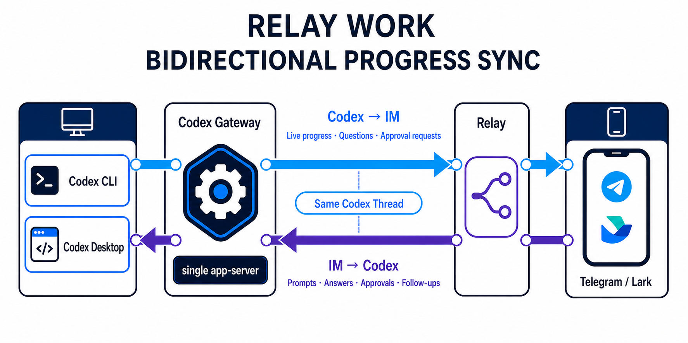

# agent-relay

[](https://github.com/zwx1127/agent-relay/actions/workflows/ci.yml)
[](LICENSE)

English | [Chinese README](README.zh-CN.md)

## Introduction

`agent-relay` lets you control a local Codex, Claude Code, or DeepSeek Harness (`dsh`) agent from Telegram or Lark/Feishu. You keep the selected backend running on a trusted machine, then use chat to choose a workspace, send prompts, answer questions, approve actions, review code, manage threads, and exchange screenshots, images, or files.

The goal is simple: keep the agent close to your code, while letting you operate it from the chat app you already use.

### Showcase

<table>
  <tr>
    <th>Telegram direct chat</th>
    <th>Telegram group topic mode</th>
  </tr>
  <tr>
    <td width="50%" valign="top">
      <video src="https://github.com/user-attachments/assets/2109bbbf-35d5-4f10-b712-409d318fdde6" width="360" controls></video>
    </td>
    <td width="50%" valign="top">
      <video src="https://github.com/user-attachments/assets/48aca05e-20f4-47f8-ac80-d93c6a4ecf60" width="360" controls></video>
    </td>
  </tr>
  <tr>
    <th>Feishu direct chat</th>
    <th>Feishu group topic mode</th>
  </tr>
  <tr>
    <td width="50%" valign="top">
      <video src="https://github.com/user-attachments/assets/b3bda23d-0eb0-402b-996c-b134562e4772" width="360" controls></video>
    </td>
    <td width="50%" valign="top">
      <video src="https://github.com/user-attachments/assets/13889a04-a32b-4ef4-beae-2df48f2a674d" width="360" controls></video>
    </td>
  </tr>
</table>

## Install with npm / npx

With Node.js 20+ and npm available, run this in an interactive terminal. No source checkout or global Bun installation is needed:

```bash
npx @asuka1127/agent-relay install
```

> **Package name:** use [`@asuka1127/agent-relay`](https://www.npmjs.com/package/@asuka1127/agent-relay). The unscoped `agent-relay` package belongs to another project: do **not** use `npx agent-relay` or `npm install -g agent-relay` for this repository.

`install` is the sole install-and-configure entry point. It previews the package and destination, asks before installation, installs the running scoped version into a persistent user-owned npm prefix, and opens the installed copy's **English-language configuration wizard**. Saving configuration does not start the relay.

> Multi-backend support is unreleased. The published npm 0.2.0 package supports Codex only; use a locally packed checkout to test Claude Code or DSH before the next release.

### Minimum requirements

- Node.js 20+ and npm. The npm package includes the official, pinned Bun runtime; see [runtime details](#installation-location-and-runtime).
- A separately installed, configured native backend: Codex CLI 0.145.0+ (`CODEX_BIN`), Claude Code 2.1.285 (`CLAUDE_BIN`), or DeepSeek Harness 0.2.0-rc.2 developer preview (`DSH_BIN`). Native executables must be on `PATH` or selected by absolute path. See [backend support and native commands](docs/en/backends.md) for verified versions and limits.
- Git for Codex workspace/version-control operations; it is not required just to install the npm package.
- A Telegram bot token, or a Lark/Feishu self-built app. Create the bot/app and sign into your accounts yourself.

### Configure your bot

The wizard first selects the native backend, then guides you through bot credentials, operator/chat allowlists, workspace root, SQLite state, and executable detection. Codex alone exposes its sandbox/approval defaults and optional experimental Gateway. Native Claude and DSH settings and authentication remain in their own configuration. Choose your code/projects directory as the workspace root, not the package directory. Use a trusted machine and allow only people you trust.

- **Telegram:** create a bot with [BotFather](https://t.me/BotFather), then enter its token and your numeric user ID. Follow the [Telegram quickstart](docs/en/quickstart-telegram.md) for the full setup.
- **Feishu/Lark:** create a self-built app in the [Feishu developer console](https://open.feishu.cn/app) or [Lark developer console](https://open.larksuite.com/app), enable Bot capability, and enter App ID/Secret and app-specific `open_id` allowlists. Save configuration and start relay **before** saving long-connection subscriptions. Finish permissions, message events, card callbacks, publication and app availability using the [Lark/Feishu quickstart](docs/en/quickstart-lark.md).

Secret input is masked. The wizard asks before sending credentials to the selected provider's official API for read-only validation. Telegram validation only uses `getMe` and `getWebhookInfo`; it never consumes `getUpdates` or deletes a webhook. Checks do not prove end-to-end delivery, platform permissions or publication. The wizard does not create bots, change webhooks, configure the platform console, install a Gateway proxy, or start the relay.

## Quick start

After saving configuration:

1. Run the **`doctor` command printed by the installer** to check local configuration, paths, Bun and the selected backend version. It does not test bot authentication, native sign-in or message delivery.
2. Run the **printed `start` command** and leave the foreground process running. For Feishu/Lark, now finish the console steps in its [quickstart](docs/en/quickstart-lark.md#3-start-the-connection-then-finish-console-setup).
3. Open a private chat with your bot and send `/relay`.
4. Select or create a workspace, send a normal prompt, and test a card button to answer a question or approve an action.

The printed commands include the absolute executable path and selected config file. **The installer does not modify `PATH`.** If you follow its optional `PATH` instructions, the short equivalents are:

```bash
agent-relay doctor
agent-relay start
```

Command examples below assume the installed executable is on `PATH`; otherwise use its printed absolute path. If you selected a custom config, keep the printed `--config` argument. To reconfigure later, run that installed copy's `install` command. If configuration was cancelled after installation, the package remains installed; rerun the printed `install` command to resume.

## What you can do

- Remote-control local Codex, Claude Code, or DeepSeek Harness sessions from Telegram or Lark/Feishu, with backend-native commands and capability limits.
- Select, create, browse, and delete workspaces from chat.
- Send normal prompts; images, voice/audio, file mentions, skills, and follow-up steering depend on the backend capability.
- Follow reasoning summaries, plan progress, tools, file changes, warnings, and diffs in one editable activity card; long details remain available for 24 hours.
- Answer native questions (including multi-select) and approve only the actions and scopes actually offered by the backend.
- Use direct chats or allowed group chats; group messages are handled only when they mention the bot.
- Use common Codex workflows such as review, Plan mode, goals, resume, fork, side conversations, interrupt, and background terminal cleanup.
- Send screenshots, generated images, or files back to chat with the optional local relay capability API.
- Put multiple agent-relay bots in one group and let agents mention configured peers for related work.
- Extend the relay to support more IM providers or agent backends.

## Daily usage

### Chat commands

Start from `/relay`. The home view shows the selected workspace, agent status, waiting state, recent errors, and available actions. `/help` shows the selected backend’s live command catalog. Claude and DSH commands retain their native arguments and meaning; they never fall through to Codex commands or silently become prompts. The existing `/relay` Home remains the workspace/status entry. Session commands keep their backend’s meaning. DSH uses `/new` to create a session and `/resume [search]` to choose a saved session; these Relay shortcuts call DSH’s native session APIs. Interruption uses the activity-card Interrupt button.

Common **Codex** commands (see the [backend command matrix](docs/en/backends.md) for Claude and DSH):

| Command | Use |
| --- | --- |
| `/help` | Show supported commands. |
| `/relay` | Open Relay Home. |
| `/review` | Review current workspace changes. |
| `/plan` | Toggle Plan mode for the current Codex thread. |
| `/plan --on` / `/plan --off` | Select Plan or Default mode explicitly. |
| `/plan <prompt>` | Enter Plan mode and run a prompt. |
| `/goal <objective>` | Set a goal for the current Codex thread. |
| `/resume` | Pick a recent Codex thread and immediately show its latest turn state. |
| `/side [prompt]`, `/btw [prompt]` | Enter or continue a multi-turn ephemeral side conversation; use **Return to main** to exit. |
| Activity/Goal card buttons | Interrupt the active turn or manage the goal. Button labels stay in English. |
| `/ps` | List Codex background terminals. |
| `/skills [search]` | Select a Codex skill, then reply with the task. |
| `/mention [search]` | Select a workspace file or directory, then reply with the task. |
| `/stop` | Ask Codex to clean background terminals. |

In group chats, mention the bot when sending text, images, files, or slash commands. Keep normal bot mentions as separate tokens, such as `/relay @relay_bot` or `@relay_bot review this change`. Telegram's native `/relay@relay_bot` command form is also accepted. Use `ALLOWED_CONVERSATION_IDS` when a bot should only respond in specific groups.

### CLI commands

| Command | Use |
| --- | --- |
| `agent-relay` / `agent-relay start` | Start in the foreground. Missing configuration exits with instructions to run `install`; it does not open the wizard. |
| `agent-relay install` | Install and configure, or reconfigure the current persistent installation. Asks before npm installation and before saving; Ctrl+C or declining save leaves the existing config unchanged. |
| `agent-relay doctor` | Check local configuration, paths, Bun and the selected backend; no bot API calls. |
| `agent-relay config path` | Show the selected config file location without displaying secrets. |
| `agent-relay gateway <setup\|start\|stop\|status\|remove>` | Manage the opt-in [experimental Gateway](#experimental-relay-work). |

### Group chats and agent teams

agent-relay works in private chats and group chats. Group chats are useful when you want a shared operator room for one or more local agents.

- Add the bot to the group and allow the group with `ALLOWED_CONVERSATION_IDS`.
- Mention the bot in text, image/file captions, and slash commands, with spaces around `@bot` or `@BotName` when it is a normal mention.
- Unmentioned group messages are ignored before authorization checks.
- Telegram forum topics and Lark/Feishu threads are treated as separate scopes, so each topic or thread can select its own workspace and run its own selected-backend session in parallel.
- Run one agent-relay process per agent bot when you want several agents in the same group.
- Configure peer agents and enable the local relay capability API when you want Codex to mention another agent bot.

See the [Telegram](docs/en/quickstart-telegram.md#4-optional-group-chat-setup) and [Lark/Feishu](docs/en/quickstart-lark.md#4-optional-group-chat-setup) quickstarts for group setup details.

## Advanced configuration

<a id="configuration-wizard-and-everyday-commands"></a>

### Configuration location and security

Configuration lives outside the package and outside the selected workspace: `$XDG_CONFIG_HOME/agent-relay/config.json` or `~/.config/agent-relay/config.json` on Linux/macOS; `%APPDATA%\agent-relay\config.json` on Windows. Override it with `--config /absolute/path/config.json` or `AGENT_RELAY_CONFIG`. The wizard creates a private directory (0700) and atomically writes a private file (0600) on POSIX. It refuses shared directories rather than changing their permissions. On Windows, store it in your private profile and protect it with user-only ACLs. The file contains plaintext credentials: never commit or share it.

Workspace and SQLite paths saved by the wizard are absolute, independent of the launch directory. State defaults to `state/agent-relay.sqlite` beside the config file; the workspace root is your code/projects directory, not the package directory. Shell environment overrides saved settings. The installed CLI does not implicitly load `.env` from the launch directory.

### Migrate an existing configuration

To migrate a source-checkout configuration (the original `.env` is left unchanged):

```bash
agent-relay install --env-file /absolute/path/to/agent-relay/.env
# Or use that file for one run without creating a saved config:
agent-relay start --env-file /absolute/path/to/agent-relay/.env
```

Only recognized relay settings are imported. Relative file paths are resolved relative to the explicit `.env` file. `--env-file` replaces the saved configuration source for that invocation; shell environment still wins. Non-interactive/CI runs never prompt: provision a private config or explicit `.env` first and pass its path. Never pass bot secrets as CLI arguments.

### Installation location and runtime

For a fresh installation, the default npm prefix is outside the checkout and npx cache:

- Linux/macOS: `$XDG_DATA_HOME/agent-relay/npm`, or `~/.local/share/agent-relay/npm`
- Windows: `%LOCALAPPDATA%\agent-relay\npm`, or `~\AppData\Local\agent-relay\npm`

Pass `install --prefix /absolute/path/to/private/prefix` to choose another user-owned destination. `--config` and `--env-file` are forwarded to the wizard. No administrator privileges are needed for a user-writable prefix. Installation never edits your shell profile or `PATH`; it prints the quoted absolute executable commands you can use immediately. On Unix the executable is `<prefix>/bin/agent-relay`; on Windows it is `<prefix>\agent-relay.cmd`. Follow the printed optional `PATH` instructions if you want to use the shorter `agent-relay` command used in command examples in this guide.

When you run `install` from a persistent installation, it detects and reuses that installation's own prefix, including a custom `--prefix` or a conventional npm global prefix. You do not need to repeat `--prefix` when reconfiguring from that executable. An explicit `--prefix` selects a different destination.

If configuration is cancelled or fails after npm succeeds, the persistent package remains installed. Use the printed `install` command to resume; existing configuration is unchanged unless you approve saving it.

The npm path requires Node.js 20+ and npm. It includes the official [`bun@1.3.11`](https://www.npmjs.com/package/bun/v/1.3.11) runtime dependency, its platform binary and non-interactive installer, so **a global Bun install is not required**. Linux/macOS/Windows on x64/arm64 are supported by that runtime; see [Bun system requirements](https://bun.com/docs/installation). The binary adds roughly 100 MB of installed runtime storage. `install` explicitly invokes npm; the normal runtime launcher does not download software. With `--ignore-scripts` or `--omit=optional`, Bun may be missing; reinstall normally or explicitly set `AGENT_RELAY_BUN_PATH` to an existing compatible Bun executable.

Repeat runs of `install` reuse a matching healthy installed version and reopen configuration. Damaged copies are offered a confirmed reinstall; an explicit `--package` reinstalls the supplied tarball.

### Alternative: global npm installation

If you prefer managing a conventional global npm installation yourself, the following is an alternative. Unlike `install`, plain `npm install -g` does not open a wizard:

```bash
npm install -g @asuka1127/agent-relay
agent-relay install
```

The second command configures the current global installation; it does not create another copy in the default user-owned prefix.

### Experimental: relay work

This shared Gateway remains Codex-only. Enabling it for Claude or DSH is rejected; those backends use their own native protocols and session stores.

> **Experimental, disabled by default, and opt-in only.** This feature may change incompatibly before it is stable. It does not start a Gateway, install a client proxy, or change existing Relay, Codex CLI, or Codex Desktop behavior unless you enable it manually.

Experimental relay work lets you begin in the native Codex CLI or the Windows/macOS Codex Desktop app, leave the computer, and continue the same Codex thread through Telegram or Lark/Feishu. Relay, interactive Codex CLI processes, and Codex Desktop all connect to one independent local Gateway and its single authoritative app-server; users run Codex normally and do not choose remote endpoints.



Run `agent-relay gateway setup` once for a persistent npm installation (or `scripts/gateway.* setup` from source), then start Gateway manually whenever relay work is needed. Use the installed executable's absolute path if it is not on `PATH`. For long-lived Gateway use, avoid an evictable npx cache; rerun setup after relocating or upgrading its installation.

- Gateway and Relay have separate scripts and lifecycles, while Gateway and its one app-server form a single failure domain.
- Use `/resume` to join an existing thread. Multiple native Codex clients and IM scopes can share a thread without ownership restrictions. New user messages, agent progress, and Relay-supported thread command state are mirrored to other attached scopes. Ordinary input during an active turn uses Steer semantics, and the first client to answer an approval or input request wins.
- BTW mode is the exception: its ephemeral child, input, output, and status stay local to the originating IM scope and never enter shared Gateway state or the parent transcript.
- Gateway mode inherits Codex configuration from the shared app-server. Relay requests do not override it, except for a one-shot mode switch after the user explicitly selects Default or Plan.
- A bounded command snapshot exists only in Gateway memory. It survives Relay restart/cleanup, but not Gateway/app-server restart; native restart semantics then apply, including Plan returning to Default.
- There is no Queue action, semantic state journal, offline output replay, or catch-up.

See [Experimental relay work](docs/en/experimental-relay-work.md) for Windows, macOS, and Linux setup, lifecycle semantics, and complete removal instructions.

## Development

### Run from source (existing workflow)

Source development requires Git and Bun 1.3+. To configure through the same wizard as npm users:

```bash
git clone https://github.com/zwx1127/agent-relay.git
cd agent-relay
bun install
npm pack
bun run cli install --package /absolute/path/asuka1127-agent-relay-0.3.0-next.2.tgz
bun run cli start
```

Use the tarball name printed by `npm pack` and replace the example path with its actual absolute path. `bun run cli install` uses the same persistent npm installation workflow, so it requires Node.js 20+ and npm and opens the installed copy's wizard; it does not run a separate source-only setup. Both the source CLI and installed CLI can then use the saved private configuration.

The original `.env` workflow also remains supported: copy `.env.example` to `.env`, edit it, and run `bun run start`. Source `bun run start` continues to read the checkout's `.env`; `bun run cli start` uses the new per-user CLI configuration. The source lifecycle scripts `scripts/relay.*` remain checkout-specific and are not installed with the npm package; use the foreground CLI with your preferred process supervisor for an npm installation.

### Install a local checkout or release tarball

To test a local build or distribute a release tarball, prepare a package from the checkout:

```bash
npm install
npm pack
```

Use the tarball name printed by `npm pack`, replace both paths below with its actual absolute path, and run this single install-and-configure command:

```bash
npx --package=/absolute/path/asuka1127-agent-relay-0.3.0-next.2.tgz agent-relay install --package /absolute/path/asuka1127-agent-relay-0.3.0-next.2.tgz
```

The first `--package` tells npx where to run the installer from; the second tells the installer which local tarball to persist, instead of downloading the registry version. The tarball must contain the matching scoped package name and version. Use only a package you trust: npm installs dependencies and runs their installation scripts.

### Extend it with itself

agent-relay is designed so you can use the running relay to improve agent-relay.

1. Start agent-relay in this repository as the selected workspace.
2. Ask Codex from Telegram or Lark/Feishu to add a new IM provider or agent backend.
3. Point Codex at the provider contracts and existing implementations.
4. Ask it to update config, factories, docs, and tests.
5. Run `bun run typecheck` and `bun test` from chat.

The main extension points are:

- IM providers: `src/ports/im.ts` and `src/providers/im/`.
- Agent providers: `src/ports/agent.ts` and `src/providers/agents/`.
- Local agent-visible capabilities: `src/relay/capabilities/`.

See [Extending agent-relay](docs/en/extending-agent-relay.md) for the suggested workflow.

## Project status

Current providers:

- IM: Telegram, Lark/Feishu.
- Agent: Codex CLI app-server.
- Storage: SQLite.

Known limitations:

- Folder attachments and automatic archive extraction are not supported.
- Codex is currently the only implemented agent backend.

## Setup guides and troubleshooting

Project documentation, the setup wizard, and user-facing messages are in English. [README.zh-CN.md](README.zh-CN.md) is the only maintained Chinese-language document.

- [Telegram quickstart](docs/en/quickstart-telegram.md)
- [Lark/Feishu quickstart](docs/en/quickstart-lark.md)
- [Troubleshooting](docs/en/troubleshooting.md)
- [Extending agent-relay](docs/en/extending-agent-relay.md)
- [Experimental relay work](docs/en/experimental-relay-work.md) (disabled by default)

### Contributing and support

- Read [CONTRIBUTING.md](CONTRIBUTING.md) before opening a pull request.
- Read [SECURITY.md](SECURITY.md) before reporting sensitive issues.
- Check [Troubleshooting](docs/en/troubleshooting.md) before opening a setup issue.
- See [CHANGELOG.md](CHANGELOG.md) for release notes.

## License

`agent-relay` is licensed under the [MIT License](LICENSE).

## Community Group

Scan the Telegram QR code below to join the project community group.


