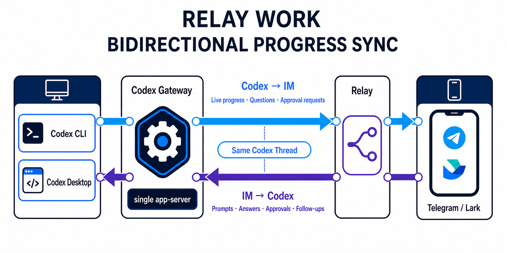

# agent-relay

[](https://github.com/zwx1127/agent-relay/actions/workflows/ci.yml)
[](LICENSE)

[English](README.md) | 中文

`agent-relay` 可以让你通过 Telegram 或 Lark/飞书远程控制本地 Codex CLI agent。Codex 仍然运行在可信机器上，你可以在聊天软件里选择工作区、发送提示词、回答问题、审批操作、发起代码审查、管理线程，并收发截图或图片。

它的目标很直接：让 agent 留在代码所在的机器上，同时让你可以从常用聊天工具里操作它。

## 项目交流群

扫描下面的 Telegram 二维码加入项目交流群。


## 演示

<table>
  <tr>
    <th>Telegram 单聊</th>
    <th>Telegram 群聊 topic 模式</th>
  </tr>
  <tr>
    <td width="50%" valign="top">
      <video src="https://github.com/user-attachments/assets/2109bbbf-35d5-4f10-b712-409d318fdde6" width="360" controls></video>
    </td>
    <td width="50%" valign="top">
      <video src="https://github.com/user-attachments/assets/48aca05e-20f4-47f8-ac80-d93c6a4ecf60" width="360" controls></video>
    </td>
  </tr>
  <tr>
    <th>飞书单聊</th>
    <th>飞书群聊 topic 模式</th>
  </tr>
  <tr>
    <td width="50%" valign="top">
      <video src="https://github.com/user-attachments/assets/b3bda23d-0eb0-402b-996c-b134562e4772" width="360" controls></video>
    </td>
    <td width="50%" valign="top">
      <video src="https://github.com/user-attachments/assets/13889a04-a32b-4ef4-beae-2df48f2a674d" width="360" controls></video>
    </td>
  </tr>
</table>

## 能做什么

- 通过 Telegram 或 Lark/飞书远程控制本地 Codex 会话。
- 在聊天里选择、创建、浏览、删除工作区。
- 发送普通提示词、图片和运行中的补充指令。
- 直接在聊天里回答 Codex 问题和审批操作。
- 支持私聊和指定群聊；群聊消息只有提及 bot 时才会被处理。
- 使用 review、Plan mode、goal、resume、fork、side conversation、interrupt、后台终端清理等常见 Codex 工作流。
- 通过可选的本地能力 API，把截图或生成图片发回聊天窗口。
- 可以把多个 agent-relay bot 放在同一个群里，让 agent 提及已配置的 peer bot 协作。
- 继续扩展更多 IM provider 或 Agent backend。

## 实验性功能：接力工作

> **本功能处于实验阶段、默认关闭，并且只能手动开启。** 在正式稳定前，其接口和启用方式可能发生不兼容变化。未手动开启时，它不会启动 Gateway、安装客户端代理，也不会改变现有 Relay、Codex CLI 或 Codex 桌面版的任何行为。

“接力工作”允许你先在原生 Codex CLI 或 Windows/macOS Codex 桌面版开始工作，离开电脑后再通过 Telegram 或 Lark/飞书继续同一个 Codex thread。Relay、交互式 Codex CLI 进程和 Codex 桌面版统一连接一个独立的本地 Gateway，由其唯一 app-server 管理 thread；用户正常启动 Codex，无需选择远端入口。



先执行一次 `scripts/gateway.* setup`，需要接力工作时再手动启动 Gateway。Gateway 与 Relay 使用完全独立的脚本和生命周期。使用 `/resume` 加入已有 thread。多个原生 Codex 客户端和 IM scope 可以共享同一个 thread，不设归属限制；新的用户消息与 agent 进度会实时同步到其他已加入的 scope，活动 turn 中的普通输入使用 Steer 语义，审批或输入请求由第一个回答的客户端胜出。Gateway 模式继承共享 Codex app-server 的配置；Relay 请求不会覆盖这些配置，唯一例外是用户明确选择 Default 或 Plan 后的一次性模式切换。它只同步 Codex、Gateway 和 Relay 都在运行并已连接后产生的新实时事件，不提供 Queue 操作，也不会保存、重放或事后追赶离线输出。请阅读[实验性接力工作](docs/zh-CN/experimental-relay-work.md)，了解 Windows、macOS 和 Linux 设置、生命周期语义以及完整移除方法。

## 快速开始

```bash
git clone https://github.com/zwx1127/agent-relay.git
cd agent-relay
bun install
cp .env.example .env
```

编辑 `.env`，填入 Telegram bot token 或 Lark/飞书应用凭证，然后启动：

```bash
bun run start
```

向 bot 发送 `/relay`，选择或创建工作区，然后像平常一样向 Codex 发送消息。

## 使用指南

- [Telegram 快速上手](docs/zh-CN/quickstart-telegram.md)
- [Lark/飞书快速上手](docs/zh-CN/quickstart-lark.md)
- [常见问题排查](docs/zh-CN/troubleshooting.md)
- [扩展 agent-relay](docs/zh-CN/extending-agent-relay.md)
- [实验性接力工作](docs/zh-CN/experimental-relay-work.md)（默认关闭）

## 最低要求

- Bun 1.3 或更新版本。
- Git。
- 本地可用的 `codex` CLI，或通过 `CODEX_BIN` 指定完整路径。
- Codex CLI 0.145.0 或更高版本需要支持 `codex app-server --listen stdio://`；实验代理会在内部使用 CLI 的 WebSocket 传输，用户不再选择单独的 remote 模式。
- Telegram bot token，或 Lark/飞书自建应用。

## 日常使用

先发送 `/relay`。Relay Home 会显示当前工作区、Codex 状态、等待状态、最近错误和可用操作。

常用命令：

| 命令 | 用途 |
| --- | --- |
| `/help` | 查看支持的命令。 |
| `/relay` | 打开 Relay Home。 |
| `/review` | 审查当前工作区改动。 |
| `/plan <prompt>` | 用 Plan mode 执行提示词。 |
| `/goal <objective>` | 为当前 Codex 线程设置目标。 |
| `/resume` | 选择最近的 Codex 线程，并立即显示其最新 turn 状态。 |
| `/side <prompt>` | 发起临时 side conversation。 |
| Activity/Goal 卡片按钮 | 中断当前 turn 或管理 Goal；按钮文案保持英文。 |
| `/ps` | 查看 Codex 后台终端。 |
| `/stop` | 要求 Codex 清理后台终端。 |

在群聊里发送文本、图片或 slash command 时，需要提及 bot。普通 bot 提及应作为独立 token 使用，例如 `/relay @relay_bot` 或 `@relay_bot review this change`；Telegram 原生的 `/relay@relay_bot` 命令格式也会兼容。如果 bot 只应该在指定群里工作，请配置 `ALLOWED_CONVERSATION_IDS`。

## 群聊和 agent 团队

agent-relay 支持私聊，也支持群聊。群聊适合作为一个共享的 agent 操作室。

- 把 bot 加入群聊，并用 `ALLOWED_CONVERSATION_IDS` 允许这个群。
- 发送文本、图片 caption 和 slash command 时提及 bot；普通 `@bot` 或 `@BotName` 前后用空格分隔。
- 未提及 bot 的群聊消息会在授权检查前被忽略。
- Telegram 论坛话题和 Lark/飞书线程会被视为独立 scope，因此同一个群里的不同话题或线程可以各自选择 workspace，并行运行独立 Codex 会话。
- 如果希望多个 agent 在同一个群里协作，每个 agent bot 运行一个 agent-relay 进程。
- 如果希望 Codex 主动提及另一个 agent bot，需要配置 peer agents 并开启本地 relay 能力 API。

Telegram 和 Lark/飞书快速上手文档里有更具体的群聊配置步骤。

## 用它扩展它自己

agent-relay 的一个重要用法，是用正在运行的 agent-relay 远程迭代 agent-relay 本身。

1. 把这个仓库作为当前工作区启动 agent-relay。
2. 在 Telegram 或 Lark/飞书里要求 Codex 增加新的 IM provider 或 Agent backend。
3. 让 Codex 参考现有 provider 接口和实现。
4. 要求它同步更新配置、工厂、文档和测试。
5. 在聊天里触发 `bun run typecheck` 和 `bun test` 验证。

主要扩展点：

- IM provider：`src/ports/im.ts` 和 `src/providers/im/`。
- Agent provider：`src/ports/agent.ts` 和 `src/providers/agents/`。
- agent 可见的本地能力：`src/relay/capabilities/`。

更多流程见 [扩展 agent-relay](docs/zh-CN/extending-agent-relay.md)。

## 项目状态

当前 provider：

- IM：Telegram、Lark/飞书。
- Agent：Codex CLI app-server。
- 存储：SQLite。

已知限制：

- 暂不支持文件/文档附件。
- 暂未配置 npm 发布，请通过 `git clone` 从源码安装。
- 当前只有 Codex 这一种 Agent backend。

## 贡献和支持

- 提交 PR 前请阅读 [CONTRIBUTING.md](CONTRIBUTING.md)。
- 报告敏感问题前请阅读 [SECURITY.md](SECURITY.md)。
- 提交安装或运行问题前，请先查看 [常见问题排查](docs/zh-CN/troubleshooting.md)。
- 版本记录见 [CHANGELOG.md](CHANGELOG.md)。

## 许可证

`agent-relay` 使用 [MIT License](LICENSE) 授权。
